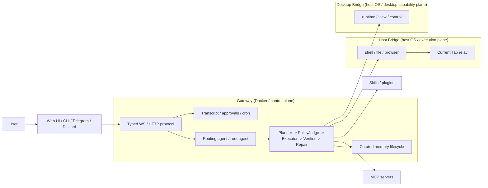

<p align="center">
  
</p>

<h1 align="center">boiled-claw</h1>

<p align="center">
  A reference architecture for closed-loop AI agents — plan, execute, verify, repair.
</p>

**Agents without a verification loop can't be trusted in production.** boiled-claw is an AI agent architecture with a closed-loop execution cycle: Planner → PolicyJudge → Executor → Verifier → Repair.

Built on Google Agent Development Kit (ADK). MIT License. Fork-friendly, upstream-curated.

> [!WARNING]
> boiled-claw can execute shell commands, read and write files, control browsers, and drive desktop UI on the host machine.
> This repository is a reference implementation, not a hardened security product. Tool approvals and security policies reduce risk, but do not guarantee safety.
> Do not expose Gateway / Host Bridge / Desktop Bridge to untrusted networks. Run it only in environments you control, and prefer isolated or disposable machines for experimentation.
> By using or running this code, you accept all risk. To the maximum extent permitted by law, the author disclaims all liability for any damage, data loss, security incident, account action, system instability, or other harm resulting from its use, misuse, or modification.

> **Note:** This is a maintainer-led reference implementation. Upstream is curated for design coherence — no support or review commitment. See [CONTRIBUTING.md](CONTRIBUTING.md).

## Features

- 🤖 **Gemini 3.1 Flash Lite Preview** - Default high-speed AI model
- 🔍 **Web Search** - Via DuckDuckGo API
- 🌐 **Browser Automation** - Scraping and screenshots with Playwright
- 🧷 **Current Tab Adapter** - Directly operate "the tab you're viewing" via Chrome extension relay
- 💻 **Shell Execution** - Secure command execution with security policies
- 📁 **File Operations** - Read and write support
- 🧩 **Host Bridge** - Run host OS shell / file / browser in a separate process
- 🧠 **Memory System** - SQLite + vector search
- 💬 **Multi-Channel** - Telegram, Discord, WebSocket support
- 🤝 **Multi-Agent Delegation** - ADK sub_agents + AgentTool + sessions_spawn
- 🔧 **Dynamic Agent Generation** - Generate agents at runtime with attached MCP servers
- 🧭 **Typed Gateway Protocol** - `chat.send` / `chat.history` / `chat.abort` / `tools.approval`
- 📝 **Persistent Transcript** - Gateway holds SQLite-backed session history
- ⏰ **Cron Platform** - System event integration, delivery targets, and retry support
- 🔌 **MCP Support** - Bundled sample MCP server supporting SSE / HTTP / stdio connections
- 🔒 **Security** - Audit logs, command policies, tool approvals
- 📦 **Extensible** - Skill plugin system
- 🐳 **Docker Ready** - Easy deployment with `docker compose`

## Architecture

Inspired by OpenClaw's control plane / execution plane separation, boiled-claw is composed of the following three layers:

- **Gateway (Docker / control plane)**: Routing, session, transcript, cron, approvals, UI event stream
- **Host Bridge (host OS / execution plane)**: Runs shell, file, and browser operations in a separate process on the host
- **Desktop Bridge (host OS / desktop capability plane)**: Runtime for GUI automation, Accessibility, and emergency stop

The desktop core lives in `src/desktop/`, with bridges hanging off it as adapters.
Common capability / ping schemas are placed in `src/bridges/common_schema.py` to ensure the desktop runtime does not depend on the host bridge schema.



## Setup

This project is designed primarily for Docker-based operation and development.
If you want to run Host Bridge or Desktop Bridge on the host OS, prepare a separate host-side Python environment for those standalone bridge processes.

### 1. Prerequisites

- Docker
- Docker Compose v2

### 2. Environment Variables

```bash
cp .env.example .env
# Edit .env and set GOOGLE_API_KEY
# Optionally configure Gateway auth:
# GATEWAY_API_KEY=change-me
# GATEWAY_AUTH_USER_HEADER=X-Auth-User
```

You can obtain a Google API Key from [Google AI Studio](https://aistudio.google.com/apikey).

Setting `GATEWAY_API_KEY` enables authentication on the Gateway's HTTP / WebSocket API.
If `GATEWAY_AUTH_USER_HEADER` is also set, the effective `user_id` is resolved from that trusted header, and cannot be overridden by the `user_id` in the path or body. When `GATEWAY_AUTH_USER_HEADER` is left unset and a shared API key is used, authenticated requests are grouped under a single shared principal.

### 3. Start the Gateway

```bash
# Start Gateway only
docker compose up -d --build boiled-claw-gateway

# Start Gateway + sample MCP server
docker compose up -d --build boiled-claw-gateway boiled-claw-mcp-sample

# View logs
docker compose logs -f boiled-claw-gateway

# Stop
docker compose down
```

Endpoints available after Gateway startup:

- Web UI: `http://127.0.0.1:18789/chat`
- WebSocket endpoint: `ws://127.0.0.1:18789/ws/{user_id}`
- Protocol schema: `http://127.0.0.1:18789/protocol`

### 4. Using from a Container

#### CLI Mode

```bash
docker compose --profile cli run --rm boiled-claw-cli cli
```

#### Channel Mode (Telegram, Discord)

```bash
# Set channel tokens in .env first
docker compose run --rm boiled-claw-gateway python -m src.main channels
```

#### Development Commands

```bash
# Unit tests
docker compose --profile dev run --rm boiled-claw-dev pytest tests/ -m "not e2e"

# E2E tests
docker compose --profile dev run --rm boiled-claw-dev pytest tests/test_e2e.py -v -m e2e

# Lint
docker compose --profile dev run --rm boiled-claw-dev ruff check src/
```

`boiled-claw-dev` uses `GATEWAY_URL=http://boiled-claw-gateway:18789` within the Docker network, so E2E tests do not depend on the host's Python environment.

#### Including Browser Automation in the Container

```bash
docker compose build --build-arg INSTALL_BROWSER=true boiled-claw-gateway
docker compose up -d boiled-claw-gateway
```

### 5. Running Host Bridge on the Host OS

To use host shell / file / browser while keeping the Gateway in Docker, start Host Bridge as a **separate process outside Docker**.

This standalone bridge does not require `GOOGLE_API_KEY`.

```bash
# Start with SSE
python -m src.main host-bridge --host 127.0.0.1 --port 8766

# Or via console script
boiled-claw-host-bridge --sse --host 127.0.0.1 --port 8766
```

Set these in `.env` or pass them as shell environment variables when running `docker compose up`.
The current `docker-compose.yml` explicitly forwards `HOST_BRIDGE_*` / `DESKTOP_BRIDGE_*` variables to the gateway / cli / dev containers, so either method works.

```bash
HOST_BRIDGE_ENABLED=true
HOST_BRIDGE_URL=http://host.docker.internal:8766/sse
BROWSER_ALLOW_LOOPBACK=true
```

If using Playwright on the Host Bridge side, install the browser extras in the host's Python environment.

To open loopback URLs like `http://localhost:18789/chat` with browser automation, enable `BROWSER_ALLOW_LOOPBACK=true` on both the Host Bridge and the Gateway.

Using `browser_navigate(..., visible=true)` opens a non-headless Playwright managed browser on the Host Bridge side. `control_ui_chat_operator` uses this visible mode by default, so conversation flows targeting `/chat` prefer a user-visible Chromium window. If Desktop Bridge is also enabled, it assists with bringing the visible browser window to the foreground.
The current browser session is a global singleton, so explicitly switching between `visible=true` and `visible=false` closes the existing session and creates a new one. Calls with `visible=None` reuse the existing session as-is. Foregrounding is best-effort; currently it assumes Playwright's Chromium window and tries `bring_to_front()` followed by Desktop Bridge `focus_window(...)`.

```bash
pip install -e '.[browser]'
playwright install
```

### 5b. Current Tab Adapter (Chrome Extension Relay)

To handle "this browser" / "this tab" in a stable way, use the Chrome extension relay instead of a Desktop hotkey. This is a minimal adapter connecting a local WebSocket server inside Host Bridge to Chrome's active tab / `chrome.scripting`.

`.env`:

```bash
CURRENT_TAB_BRIDGE_ENABLED=true
CURRENT_TAB_BRIDGE_HOST=127.0.0.1
CURRENT_TAB_BRIDGE_PORT=8768
CURRENT_TAB_BRIDGE_TOKEN=change-me
```

Loading the Chrome extension:

1. Open `chrome://extensions` in Chrome
2. Enable `Developer mode`
3. Click `Load unpacked` and select `chrome_extension/current_tab_adapter`
4. Open the extension's `Options` page to configure the relay URL and token

This extension requires `<all_urls>` host permission because it uses `chrome.scripting` on the active tab. This is necessary to perform selector click / fill / text extraction on "whichever tab the user is currently viewing" regardless of the site. Communication itself is limited to the local relay only, restricted by loopback bind, origin check, and an optional token.

The extension continuously reconnects to the relay, so it is easiest to start Host Bridge first. The current vertical slice supports the following operations:

- Get active tab info
- Navigate the active tab to a URL
- Selector click
- Selector fill
- Selector text extraction

This is the minimal implementation for routing current-tab research flows like "use this browser to look up ..." through the browser natively rather than through the desktop control loop.
Bridges bind to loopback only by default. DNS rebinding protection is also enabled on Host/Desktop Bridge.
Only set `BRIDGE_ALLOW_REMOTE_BIND=true` explicitly if you need to allow binding to addresses like `0.0.0.0`.

### 6. Desktop Bridge

Desktop Bridge is a thin adapter that calls `DesktopClient`.
Currently it includes a macOS implementation using `pyobjc`, and supports:
emergency stop management via `runtime.status` / `runtime.stop` / `runtime.clear_stop`,
`frontmost_app` / `windows` / `screenshot` / `ax_find` / `ax_snapshot`,
`wait_window` / `wait_element`, `launch_app` / `focus_window` / `click` / `type` / `hotkey` / `scroll` / `drag`.
`click` and `type` support not only coordinate-based targeting but also Accessibility selector-based targeting.
Screenshots use `screencapture` as a pragmatic Phase 1 fallback. In the future, even if the native companion switches to ScreenCaptureKit, the `DesktopClient` surface will remain unchanged.
This bridge can also run standalone and does not require `GOOGLE_API_KEY`.

Desktop request routing is split as follows:

- Single-shot desktop view / runtime safety: `desktop_operator`
- Single-shot desktop control: `desktop_operator`
- Multi-step desktop automation with verification: `control_loop`

```bash
pip install -e '.[desktop]'
```

The desktop extra uses `pyobjc-framework-Cocoa`. In PyObjC's current structure, AppKit / Foundation are resolved through this umbrella package. If your existing environment pins a separate `pyobjc-framework-AppKit`, reinstalling the desktop extra is recommended.

```bash
python -m src.main desktop-bridge --host 127.0.0.1 --port 8767

# Or via console script
boiled-claw-desktop-bridge --sse --host 127.0.0.1 --port 8767
```

To use Desktop Bridge from the Gateway, set the following in `.env`:

```bash
DESKTOP_BRIDGE_ENABLED=true
DESKTOP_BRIDGE_URL=http://127.0.0.1:8767/sse
```

## Project Structure

```
boiled-claw/
├── src/
│   ├── agents/
│   │   ├── root_agent.py       # Main agent (gemini-3.1-flash-lite-preview)
│   │   ├── sub_agents.py       # Sub-agent definitions
│   │   └── model_config.py     # Model configuration management
│   ├── gateway/
│   │   ├── server.py           # WebSocket gateway server
│   │   ├── protocol.py         # Typed Gateway Protocol v1
│   │   ├── transcript.py       # Persistent transcript / history
│   │   ├── session_manager.py  # Session management
│   │   └── router.py           # Message routing
│   ├── bridges/
│   │   ├── common_schema.py         # Bridge/runtime common schema
│   │   ├── host_bridge_schema.py     # Host Bridge contract
│   │   ├── host_bridge_client.py     # Host Bridge MCP client
│   │   ├── host_bridge_exec.py       # Host Bridge common execution helper
│   │   └── desktop_bridge_schema.py  # Desktop Bridge contract
│   ├── browser/
│   │   └── current_tab_bridge.py     # Chrome extension relay server
│   ├── desktop/
│   │   ├── client.py           # Desktop runtime interface
│   │   ├── runtime.py          # Emergency stop / runtime state
│   │   ├── fake_client.py      # Fake runtime for contract tests
│   │   ├── pyobjc_client.py    # macOS pyobjc implementation
│   │   └── factory.py          # Runtime factory
│   ├── tools/
│   │   ├── web_search.py       # Web search
│   │   ├── shell.py            # Shell execution
│   │   ├── file_manager.py     # File operations
│   │   ├── context.py          # ToolContext common resolution
│   │   ├── browser.py          # Browser automation
│   │   ├── current_tab.py      # Current-tab browser tools
│   │   ├── memory.py           # Memory tools
│   │   └── subagents.py        # Sub-agent / dynamic agent management
│   ├── mcp_servers/
│   │   ├── sample_server.py         # Sample MCP server
│   │   ├── host_bridge_server.py    # Host Bridge MCP server
│   │   └── desktop_bridge_server.py # Desktop Bridge adapter server
│   ├── channels/
│   │   ├── base.py             # Channel base class
│   │   ├── registry.py         # Channel registry
│   │   ├── telegram.py         # Telegram integration
│   │   └── discord_ch.py       # Discord integration
│   ├── memory/
│   │   └── (memory store implementation)
│   ├── security/
│   │   ├── audit.py            # Audit logs
│   │   ├── policy.py           # Command/path security policy
│   │   └── tool_policy.py      # Tool approvals / per-agent policy
│   ├── config/
│   │   ├── settings.py         # Pydantic settings
│   │   └── schema.py           # Configuration schema
│   ├── skills/
│   │   ├── loader.py           # Skill loader
│   │   └── base.py             # Skill base class
│   └── main.py                 # Entry point
├── tests/
│   ├── test_sample_mcp_server.py  # MCP server tests
│   └── ...
├── Dockerfile
├── docker-compose.yml
├── pyproject.toml
├── .env.example
└── README.md
```

## Usage

### Using via CLI

```bash
$ docker compose --profile cli run --rm boiled-claw-cli cli

You: Search for the latest Python news

boiled-claw 🦀 [Running web search...]
Python 3.12 has been released...
```

### Using via WebSocket

```python
import asyncio
import json
import websockets

async def chat():
    uri = "ws://127.0.0.1:18789/ws/my_user_id"
    async with websockets.connect(uri) as websocket:
        connected = json.loads(await websocket.recv())
        print("connected:", connected)

        await websocket.send(json.dumps({
            "event": "chat.send",
            "text": "Hello, boiled-claw!",
            "request_id": "demo-1"
        }))

        while True:
            event = json.loads(await websocket.recv())
            print(event)
            if event["event"] == "chat.done":
                break

asyncio.run(chat())
```

Primary events sent by the client:

- `chat.send`
- `chat.inject`
- `chat.abort`
- `chat.history`
- `presence.ping`
- `tools.approval`

Primary events returned by the server:

- `connected`
- `chat.done`
- `chat.history`
- `system.event`
- `health.tick`
- `cron.update`
- `tools.approval_request`

The event schema can be retrieved via `GET /protocol`.

### Using via HTTP API (curl)

```bash
curl -sS -X POST http://127.0.0.1:18789/agent/run \
  -H "Content-Type: application/json" \
  -H "Authorization: Bearer ${GATEWAY_API_KEY}" \
  -d '{
    "user_id": "curl_user",
    "message": "Tell me the 3 latest NVIDIA news items"
  }'
```

If `GATEWAY_API_KEY` is not set, the `Authorization` header is not required.
Specify a `session_id` to continue the same conversation.

### Gateway Authentication and `user_id`

- Auth disabled: Uses the `user_id` from the HTTP body / WebSocket path as-is.
- `GATEWAY_API_KEY` only: Authenticated requests are grouped under a single shared principal.
- `GATEWAY_API_KEY` + `GATEWAY_AUTH_USER_HEADER`: The effective `user_id` is resolved from the trusted header.

In other words, when auth is enabled, the `user_id` in the path/body is not trusted as a transcript ownership boundary. The expected setup is a reverse proxy or API gateway that passes the authenticated user ID via `GATEWAY_AUTH_USER_HEADER`.

### Key Gateway Endpoints

- `GET /protocol` - Typed protocol schema
- `GET /sessions/{user_id}` - Session list
- `GET /sessions/{user_id}/{session_id}/history` - Transcript history
- `GET /transcript/sessions?user_id=...` - Transcript-backed session summaries
- `POST /cron` / `GET /cron` - Cron platform
- `GET /tools/policy` - Tool policy list
- `GET /tools/approvals` - Pending approval list

### Using with Telegram

1. Create a Telegram Bot via BotFather
2. Set `TELEGRAM_BOT_TOKEN` in `.env`
3. Start with `docker compose run --rm boiled-claw-gateway python -m src.main channels`
4. Send a message to the Bot on Telegram

## Feature List

### Tools

- **web_search** - Web search via DuckDuckGo API
- **browser_navigate** - Navigate to a URL
- **browser_click** - Click an element
- **browser_fill** - Fill a form field
- **browser_press** - Send a key press (e.g., Enter)
- **browser_screenshot** - Take a screenshot
- **browser_extract_text** - Extract text
- **run_shell** - Execute a shell command
- **read_file** - Read a file
- **write_file** - Write a file
- **memory_store** - Save to memory
- **memory_search** - Search memory
- **agents_list** - List available sub-agents
- **sessions_spawn** - Launch a sub-agent in the background
- **sessions_spawn_dynamic** - Generate and launch a dynamic agent with MCP servers
- **subagents_list** - Check sub-agent execution status
- **subagents_steer** - Send additional input to a mode=session sub-agent
- **subagents_kill** - Stop a sub-agent execution
- **skill_list** - List loaded skills
- **skill_execute** - Execute a specified skill
- **skill_spawn** - Launch a dynamic agent using skill content as its instruction

### Dynamic Agent Generation (sessions_spawn_dynamic)

You can dynamically generate custom agents at runtime by specifying a system prompt and MCP servers.

```bash
# Launch an agent (example: attach the sample MCP server)
curl -sS -X POST http://127.0.0.1:18789/agent/run \
  -H "Content-Type: application/json" \
  -d '{
    "user_id": "my_user",
    "message": "Launch an agent with sessions_spawn_dynamic. instruction=\"You are a calculation agent\", mcp_servers=[{\"type\":\"sse\",\"url\":\"http://boiled-claw-mcp-sample:8765/sse\"}], task=\"Calculate 100 + 200\""
  }'

# Check execution results
curl http://127.0.0.1:18789/subagents/{session_id}
```

**MCP Connection Types:**

| type | Description | Configuration Example |
|------|-------------|----------------------|
| `sse` | SSE connection | `{"type": "sse", "url": "http://..."}` |
| `http` | Streamable HTTP connection | `{"type": "http", "url": "http://..."}` |
| `stdio` | Subprocess launch | `{"type": "stdio", "command": "npx", "args": [...]}` |

### Sample MCP Server

A FastMCP-based sample server is bundled in `src/mcp_servers/sample_server.py`.

**Provided Tools:**

| Tool | Description |
|------|-------------|
| `echo(text)` | Returns the text as-is |
| `add(a, b)` | Adds two numbers |
| `current_time()` | Returns the current datetime in ISO 8601 |
| `reverse_text(text)` | Reverses the text |

**How to Start:**

```bash
# SSE mode (defined in docker-compose.yml)
docker compose up -d boiled-claw-mcp-sample
# → Available within the Docker network at http://boiled-claw-mcp-sample:8765/sse
```

Within the Docker network, connect via `http://boiled-claw-mcp-sample:8765/sse`.

### Using Skills

- Adding `skills/<name>/SKILL.md` will auto-load it at startup (OpenClaw format).
- For backward compatibility, the legacy `skills/*.py` format is still loaded.
- After the Gateway starts, check loading status via `GET /skills`.
- Use `skill_execute` to inspect and run a skill's content.
- Use `skill_spawn` to delegate task execution using the skill content as a dynamic agent's instruction.
- Sample skills are bundled: `skills/coding-agent/SKILL.md` and `skills/e2e-test/SKILL.md`.

### Security

- Audit logs (all operations are recorded)
- Command blocklist
- Path access control
- Secret detection
- Per-agent tool policy
- Tool approval request / resolve (`tools.approval_request`, `tools.approval`)
- Transcript ownership protection via Gateway API key + trusted identity header

### Channels

- Telegram (python-telegram-bot)
- Discord (discord.py)
- WebSocket (FastAPI)

## Development

### Tests

```bash
docker compose --profile dev run --rm boiled-claw-dev pytest tests/ -m "not e2e"
```

### Lint

```bash
docker compose --profile dev run --rm boiled-claw-dev ruff check src/
```

## Roadmap

- [x] Core agent structure (Google ADK)
- [x] Gemini 3.1 Flash Lite Preview model
- [x] Web search tool
- [x] Shell execution tool
- [x] File operations tool
- [x] Browser automation (Playwright)
- [x] Memory system (SQLite + vector search)
- [x] WebSocket gateway
- [x] Typed Gateway Protocol v1
- [x] Gateway-owned transcript / history persistence
- [x] Cron platform (delivery target / retry / system events)
- [x] Tool security / approvals
- [x] Telegram channel
- [x] Discord channel
- [x] Security (audit logs + policies)
- [x] Docker support
- [x] Multi-agent (sub-agents)
- [x] Skill plugin system
- [x] Dynamic agent generation (sessions_spawn_dynamic)
- [x] MCP support (SSE / HTTP / stdio) + sample server
- [ ] Redis sessions
- [ ] Slack channel
- [ ] WhatsApp channel
- [ ] Canvas (visual workspace)
- [ ] Voice interface

## References

- [OpenClaw](https://github.com/openclaw/openclaw) - Inspiration source (large-scale TypeScript project with 1,500-2,000 files)
- [Google ADK](https://google.github.io/adk-docs/) - Agent framework
- [MCP (Model Context Protocol)](https://modelcontextprotocol.io/) - Tool connection protocol

## License

MIT
