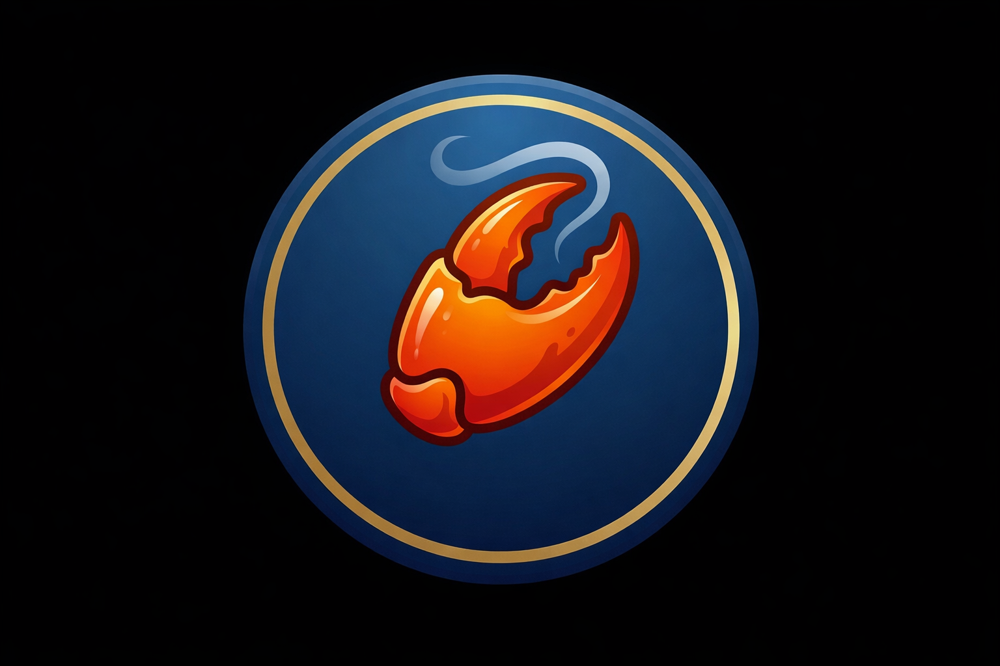
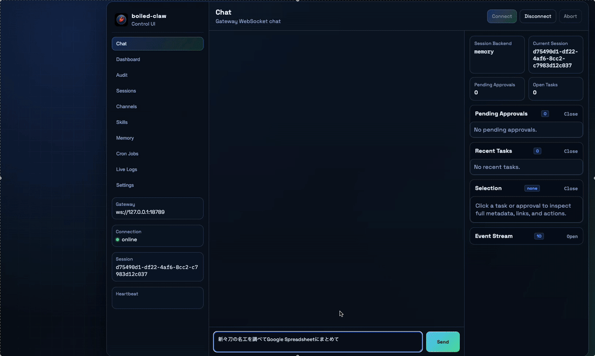
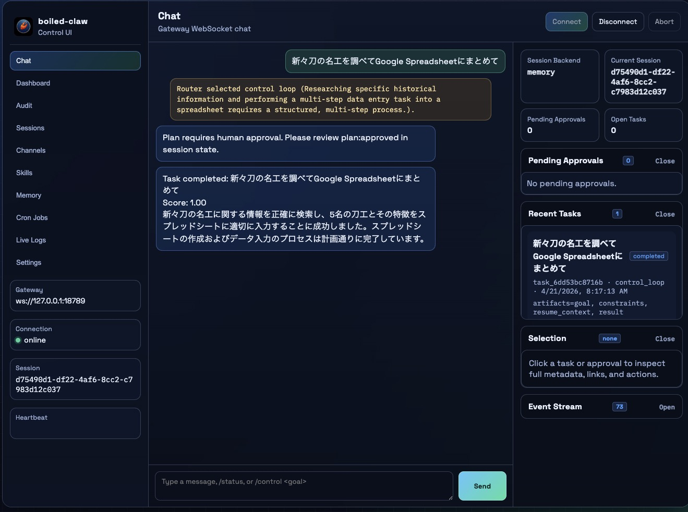
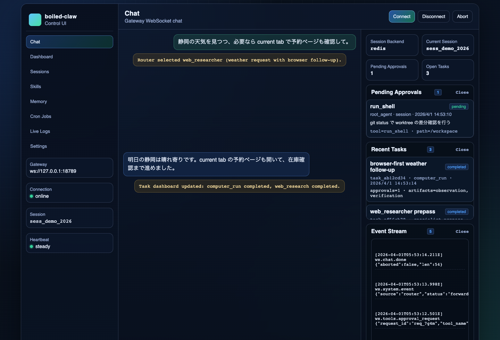

<p align="center">
  
</p>

<h1 align="center">boiled-claw</h1>

<p align="center">
  Closed-loop agent runtime for browser-first work and simulation-first physical validation.
</p>

<p align="center">
  Browser-first. Verification-driven. Mission-oriented. Simulation-ready.
</p>

boiled-claw is an open, lightweight reference system for agents that can plan,
execute, verify, repair, review, and improve across browsers, desktop apps, and
simulation-first physical AI environments.

Built on Google Agent Development Kit (ADK). MIT License. Fork-friendly,
upstream-curated.

> [!CAUTION]
> This is a reference implementation, not a hardened security product. It can
> run shell/file/browser/desktop actions on machines you control. Keep Gateway
> and bridges on loopback or trusted networks, and use disposable environments
> for experiments.
> By using or running this code, you accept responsibility for any effects on
> your machine, accounts, data, or connected services.

## Why boiled-claw

The next important open agent framework will not be the biggest model wrapper.
It will be the most editable closed-loop system that can move from browser tasks
toward real-world operations without changing its core philosophy.

The winning agent stack in 2026 is not just "LLM + tools." It is closer to an
AutoResearch-style research / act / evaluate loop:

```text
observe -> act -> verify -> store trajectory -> improve
```

boiled-claw keeps the OpenClaw spirit of local-first, composable, inspectable
tooling, but puts verification and recovery at the center. Browser automation
and physical AI look different at the actuator layer, but they share the same
control vocabulary: mission contract, evidence, verifier verdict, recovery
decision, replay, benchmark gate, and operator approval.

That shared vocabulary is practical: browser trajectories can become replayable
evidence, recovery policies, and benchmark cases before the same contracts are
exercised in simulation-first validation.

## Demo

Example flow: the operator asks boiled-claw, in Japanese, to research notable
`新々刀` swordsmiths and summarize the findings into Google Sheets. The animation
is a README-friendly conversion of a real execution recording, followed by the
captured result state from the Control UI.

It exercises the full closed loop: current-tab navigation, web research,
structured extraction, sheet write, destination-bound verification, and
operator-visible evidence in the Control UI.





## What boiled-claw Is

- A verification-driven control plane across current tabs, managed browsers,
  desktop fallback, and simulation-first adapters.
- A trajectory-native closed-loop runtime where evidence, replay, recovery, and
  review are first-class artifacts.
- An approval-gated self-improvement runtime that measures candidates in
  canaries before promotion.

## What boiled-claw Is Not

- An unstoppable agent without a kill switch.
- A fully autonomous robotics stack.
- A safety-free self-modifying runtime.
- A polished SaaS abstraction that hides the internals.

## Quickstart

If you want the shortest path from clone to a working session, start here:

```bash
make quickstart
```

This creates `.env` from `.env.example` if needed, builds and starts the Gateway,
waits for `/health` and `/protocol`, then writes a deterministic smoke task and
verifies it through `/tasks/{task_id}` and `/tasks/{task_id}/timeline`.

The quickstart smoke intentionally does **not** require a real `GOOGLE_API_KEY`,
the Chrome extension, Host Bridge, or Desktop Bridge. It proves the first-run
runtime is alive before you connect model-backed or host-side automation.

After it completes, open `http://127.0.0.1:18789/chat`.

Manual fallback:

1. Create your local config:

   ```bash
   cp .env.example .env
   ```

2. Start the Gateway:

   ```bash
   docker compose up -d --build boiled-claw-gateway
   ```

3. Open the Control UI or use the CLI:

   ```bash
   docker compose --profile cli run --rm boiled-claw-cli chat
   ```

   Then visit `http://127.0.0.1:18789/chat` in your browser.

The Web UI is the easiest way to understand the system. The CLI hits the same Gateway and is useful for quick smoke tests or scripted runs.

## Startup Patterns

Use the startup path that matches what you are trying to do:

- **Prove a first local runtime works:** `make quickstart`
  - Starts the Gateway, waits for health/protocol, creates a no-model task, and verifies its timeline through HTTP.
- **Try chat / search / task UI only:** `docker compose up -d --build boiled-claw-gateway`
  - Starts the Gateway only. Use this after quickstart when you already have local config.
- **Use desktop or host-side computer control too:** `bash scripts/bridge_runtime.sh start`
  - Starts the host-side Host Bridge and Desktop Bridge processes outside Docker.
- **Reflect Python source changes quickly:** `bash scripts/deploy_runtime.sh sync`
  - Starts bridges if needed, copies `src/` into the running container, and restarts the Gateway without a full rebuild.
- **Rebuild the runtime image and restart:** `bash scripts/deploy_runtime.sh build`
  - Starts bridges if needed, rebuilds the Gateway image, and recreates the container.
- **Let the script choose rebuild or hot-sync:** `bash scripts/deploy_runtime.sh deploy`
  - Normal deploy path. It prefers a Docker rebuild and falls back to `sync` when rebuild is not possible.
- **Check what is already running:** `bash scripts/deploy_runtime.sh status`
  - Prints bridge and Gateway status.

If you want browser / desktop automation, do not stop at the Quickstart alone: those capabilities require the host-side bridges in addition to the Dockerized Gateway.

## Control UI

The Gateway ships a browser-based chat, task dashboard, audit explorer, detail / intervention panel, task timeline, and event stream so you can see routing, approvals, tool results, recovery, and operator actions in one place.



The UI above shows the typical flow: a user request, router handoff, an approval checkpoint, recent task and approval state, an agent response, and the live event stream that explains what happened. The Dashboard and Audit tabs then let you drill into task artifacts, inspect merged task timelines, jump into related audit events, replay failed control-loop runs, compare replays against the baseline task, and watch task / approval / audit updates arrive over the WebSocket without leaving the Control UI.

## Architecture Overview

Start with the short English overview in
[architecture/README.md](architecture/README.md) if you want the system shape
before reading deeper design notes. The root [ARCHITECTURE.md](ARCHITECTURE.md)
is a Japanese-first deep dive, while `architecture/` contains focused notes on
routing, bridges, control-loop memory, Mission OS, and trajectory-native
self-improvement.

## Current Direction

boiled-claw is now moving from a closed-loop task runtime toward a **Mission OS**:
a durable, policy-bounded runtime for long-running missions that can be executed,
verified, recovered, reviewed, evaluated, and improved through approval-gated
promotion.

The core loop is:

```text
MissionContract
  -> control_supervisor task
  -> durable_execution
  -> execute / verify / recover
  -> mission_review
  -> mission_eval_result
  -> benchmark-gated promotion package
  -> approved memory / skill / capability / policy
  -> future mission reuse
```

What exists today:

- Browser-first recovery with trajectory capture and replay.
- Live `control_supervisor` missions with Mission Contract, task graph,
  scheduler queue, heartbeat, checkpoint, resume, and typed recovery decisions.
- Mission scorecards, post-mission review, approval-gated memory candidates,
  mission templates, deterministic mission eval suites, promotion packages, and
  artifact-only approved promotion paths and reuse plans.
- Current-tab Google Sheets vertical slice with destination-bound evidence and
  Control UI visibility.
- Simulation-first physical runtime artifacts for validation, telemetry,
  action envelopes, governor decisions, and offline replay plans.

Near-term work is focused on the promotion loop:

- Aggregate promotion packages across canary benchmark suites.
- Connect reuse plans to live mission start only after provenance and policy
  checks are mature.
- Keep physical work simulation-first until replay and eval gates are mature.

See [architecture/README.md](architecture/README.md) for the short system
overview and
[architecture/trajectory-native-self-improving-runtime.md](architecture/trajectory-native-self-improving-runtime.md)
for the deeper design.

## Differentiating Features

- **Current-tab first computer use**: operate the browser tab the operator is
  actually viewing, then fall back to managed browser or desktop control when
  needed.
- **Mission Contract runtime**: long-running `control_supervisor` tasks carry a
  manifest, task graph, scheduler queue, checkpoints, resume state, verifier
  evidence, and recovery decisions.
- **Trajectory-native recovery**: failed or uncertain actions produce evidence,
  verifier verdicts, typed recovery decisions, replayable timelines, and audit
  records instead of silent retries.
- **Approval-gated self-improvement**: mission reviews produce improvement and
  memory candidates; eval gates and promotion packages keep reuse explicit and
  operator-approved.
- **Simulation-first physical path**: physical-adjacent work starts as mission
  contracts, verifier results, telemetry snapshots, action envelopes, governor
  decisions, and offline replay plans.
- **Operator-visible runtime**: Control UI exposes chat, task dashboard, audit
  explorer, timeline, replay/compare, mission scorecard, recovery, review, and
  candidate state.
- **Hackable reference stack**: Dockerized Gateway, host/desktop bridges, MCP,
  skills, SQLite-backed task/memory state, and an ADK-backed model layer with
  Gemini currently used as the default backend.

## Layer Map

Inspired by OpenClaw's control plane / execution plane separation, boiled-claw
is composed of the following layers:

- **Gateway (Docker / control plane)**: Routing, session, transcript, cron, approvals, UI event stream
- **Host Bridge (host OS / execution plane)**: Runs shell, file, and browser operations in a separate process on the host
- **Desktop Bridge (host OS / desktop capability plane)**: Runtime for GUI automation, Accessibility, and emergency stop
- **Runtime substrate (common registry plane)**: Canonical resources / capabilities over skills + bridges + browser-first surfaces

The desktop core lives in `src/desktop/`, with bridges hanging off it as adapters.
Common capability / ping schemas are placed in `src/bridges/common_schema.py` to ensure the desktop runtime does not depend on the host bridge schema.
The runtime substrate then lifts those scattered tools into `resource_list`, `resource_read`, `capability_list`, and `capability_invoke`, so Gateway HTTP routes and the root agent can inspect skills and bridge-backed surfaces through one canonical layer.

```text
User
  -> Web UI / CLI / API
  -> Gateway
       - typed WebSocket / HTTP protocol
       - routing agent / root agent
       - Planner -> PolicyJudge -> Executor -> Verifier -> Repair
       - transcript / approvals / cron
       - curated memory lifecycle
       - runtime substrate: resource_* / capability_*
  -> Host Bridge
       - shell / file / browser
       - Current Tab relay
  -> Desktop Bridge
       - runtime / view / control
  -> MCP servers and skills
```

## Setup

This project is designed primarily for Docker-based operation and development.
If you want to run Host Bridge or Desktop Bridge on the host OS, prepare a separate host-side Python environment for those standalone bridge processes.

### 1. Prerequisites

- Docker
- Docker Compose v2

### 2. Environment Variables

```bash
cp .env.example .env
# Edit .env and set GOOGLE_API_KEY
# Optionally configure Gateway auth:
# GATEWAY_API_KEY=change-me
# GATEWAY_AUTH_USER_HEADER=X-Auth-User
# Optionally persist live ADK sessions in Redis:
# REDIS_URL=redis://boiled-claw-redis:6379/0
# REDIS_SESSION_NAMESPACE=boiled-claw:sessions
```

You can obtain a Google API Key from [Google AI Studio](https://aistudio.google.com/apikey).

Setting `GATEWAY_API_KEY` enables authentication on the Gateway's HTTP / WebSocket API.
If `GATEWAY_AUTH_USER_HEADER` is also set, the effective `user_id` is resolved from that trusted header, and cannot be overridden by the `user_id` in the path or body. When `GATEWAY_AUTH_USER_HEADER` is left unset and a shared API key is used, authenticated requests are grouped under a single shared principal.

`REDIS_URL` only changes the live ADK session backend used by Gateway / CLI / channel runners. Transcript history, task objects, computer trajectories, memory, and physical validation state stay in SQLite.

### 3. Start the Gateway

```bash
# Start Gateway only
docker compose up -d --build boiled-claw-gateway

# Start Gateway + sample MCP server
docker compose up -d --build boiled-claw-gateway boiled-claw-mcp-sample

# View logs
docker compose logs -f boiled-claw-gateway

# Stop
docker compose down
```

To deploy the current local workspace into the running runtime, use:

```bash
./scripts/deploy_runtime.sh deploy
```

This starts the host / desktop bridge processes, then tries to rebuild the
Gateway from the current workspace. If Docker rebuild is unavailable, it falls
back to hot-syncing `src/` into the running `boiled-claw-gateway` container and
restarts it. For source-only hot reload, use:

```bash
./scripts/deploy_runtime.sh sync
```

### 3a. Optional: Start Redis-backed Session State

```bash
# In .env:
# REDIS_URL=redis://boiled-claw-redis:6379/0
# REDIS_SESSION_NAMESPACE=boiled-claw:sessions

docker compose --profile redis up -d --build boiled-claw-redis boiled-claw-gateway
```

Use this when you want Gateway, CLI, and channel workers to share the same live ADK session state across processes or container restarts. This does not replace SQLite-backed transcript or task persistence.

Endpoints available after Gateway startup:

- Web UI: `http://127.0.0.1:18789/chat`
- WebSocket endpoint: `ws://127.0.0.1:18789/ws/{user_id}`
- Protocol schema: `http://127.0.0.1:18789/protocol`

### 4. Using from a Container

#### CLI Mode

```bash
docker compose --profile cli run --rm boiled-claw-cli chat
```

> **Note:** The legacy `cli` command name still works as an alias for `chat`.

#### Development Commands

```bash
# Unit tests
docker compose --profile dev run --rm boiled-claw-dev pytest tests/ -m "not e2e"

# E2E tests
docker compose --profile dev run --rm boiled-claw-dev pytest tests/test_e2e.py -v -m e2e

# Lint
docker compose --profile dev run --rm boiled-claw-dev ruff check src/
```

`boiled-claw-dev` uses `GATEWAY_URL=http://boiled-claw-gateway:18789` within the Docker network, so E2E tests do not depend on the host's Python environment.

#### Including Browser Automation in the Container

```bash
docker compose build --build-arg INSTALL_BROWSER=true boiled-claw-gateway
docker compose up -d boiled-claw-gateway
```

### 5. Running Host Bridge on the Host OS

To use host shell / file / browser while keeping the Gateway in Docker, start Host Bridge as a **separate process outside Docker**.

This standalone bridge does not require `GOOGLE_API_KEY`.

```bash
# Start with SSE
python -m src.main bridge host --host 127.0.0.1 --port 8766

# Or via console script
boiled-claw-host-bridge --sse --host 127.0.0.1 --port 8766
```

> **Note:** The legacy `host-bridge` command name still works as an alias for `bridge host`.

Set these in `.env` or pass them as shell environment variables when running `docker compose up`.
The current `docker-compose.yml` explicitly forwards `HOST_BRIDGE_*` / `DESKTOP_BRIDGE_*` variables to the gateway / cli / dev containers, so either method works.

```bash
HOST_BRIDGE_ENABLED=true
HOST_BRIDGE_URL=http://host.docker.internal:8766/sse
BROWSER_ALLOW_LOOPBACK=true
```

If using Playwright on the Host Bridge side, install the browser extras in the host's Python environment.

To open loopback URLs like `http://localhost:18789/chat` with browser automation, enable `BROWSER_ALLOW_LOOPBACK=true` on both the Host Bridge and the Gateway.

Using `browser_navigate(..., visible=true)` opens a non-headless Playwright managed browser on the Host Bridge side. `control_ui_chat_operator` uses this visible mode by default, so conversation flows targeting `/chat` prefer a user-visible Chromium window. If Desktop Bridge is also enabled, it assists with bringing the visible browser window to the foreground.
The current browser session is a global singleton, so explicitly switching between `visible=true` and `visible=false` closes the existing session and creates a new one. Calls with `visible=None` reuse the existing session as-is. Foregrounding is best-effort; currently it assumes Playwright's Chromium window and tries `bring_to_front()` followed by Desktop Bridge `focus_window(...)`.

```bash
pip install -e '.[browser]'
playwright install
```

### 5b. Current Tab Adapter (Chrome Extension Relay)

To handle "this browser" / "this tab" in a stable way, use the Chrome extension relay instead of a Desktop hotkey. This is a minimal adapter connecting a local WebSocket server inside Host Bridge to Chrome's active tab / `chrome.scripting`.

`.env`:

```bash
CURRENT_TAB_BRIDGE_ENABLED=true
CURRENT_TAB_BRIDGE_HOST=127.0.0.1
CURRENT_TAB_BRIDGE_PORT=8768
CURRENT_TAB_BRIDGE_TOKEN=change-me
```

Loading the Chrome extension:

1. Open `chrome://extensions` in Chrome
2. Enable `Developer mode`
3. Click `Load unpacked` and select `chrome_extension/current_tab_adapter`
4. Open the extension's `Options` page to configure the relay URL and token

This extension requires `<all_urls>` host permission because it uses `chrome.scripting` on the active tab. This is necessary to perform selector click / fill / text extraction on "whichever tab the user is currently viewing" regardless of the site. Communication itself is limited to the local relay only, restricted by loopback bind, origin check, and an optional token.

Current-browser spreadsheet plans normalize navigation through `current_tab.navigate` instead of relying on a Desktop `Cmd/Ctrl+T` hotkey. When the active tab is the boiled-claw Control UI chat, the runtime preserves that chat tab by opening a separate task tab before navigating. Spreadsheet entry steps also now locate and click a real grid cell such as `A1` before typing so writes land in the sheet instead of the browser chrome or Sheets toolbar.

The extension continuously reconnects to the relay, so it is easiest to start Host Bridge first. The current vertical slice supports the following operations:

- Get active tab info
- Navigate the active tab to a URL
- Selector click
- Selector fill
- Selector text extraction

This is the minimal implementation for routing current-tab research flows like "use this browser to look up ..." through the browser natively rather than through the desktop control loop.
For browser-first computer-use tasks, `computer_operator` combines this relay with desktop observations so the agent can inspect the visible browser/UI first, stay on the current tab when possible, and fall back to Desktop Bridge only when DOM-level control is insufficient. The higher-level `computer_observe`, `computer_evaluate`, `computer_click`, `computer_fill`, and `computer_trajectory_recent` tools bundle that browser-first selection so a caller can observe once, verify expectations, recover across surfaces, and inspect recent trajectories.
Bridges bind to loopback only by default. DNS rebinding protection is also enabled on Host/Desktop Bridge.
Only set `BRIDGE_ALLOW_REMOTE_BIND=true` explicitly if you need to allow binding to addresses like `0.0.0.0`.

### 6. Desktop Bridge

Desktop Bridge is a thin adapter that calls `DesktopClient`.
Currently it includes a macOS implementation using `pyobjc`, and supports:
emergency stop management via `runtime.status` / `runtime.stop` / `runtime.clear_stop`,
`frontmost_app` / `windows` / `screenshot` / `ax_find` / `ax_snapshot`,
`wait_window` / `wait_element`, `launch_app` / `focus_window` / `click` / `type` / `hotkey` / `scroll` / `drag`.
`click` and `type` support not only coordinate-based targeting but also Accessibility selector-based targeting.
Screenshots use `screencapture` as a pragmatic Phase 1 fallback. In the future, even if the native companion switches to ScreenCaptureKit, the `DesktopClient` surface will remain unchanged.
This bridge can also run standalone and does not require `GOOGLE_API_KEY`.

Desktop request routing is split as follows:

- Single-shot desktop view / runtime safety: `desktop_operator`
- Single-shot desktop control: `desktop_operator`
- Browser-first visible UI operation with current-tab preference: `computer_operator`
- Multi-step desktop automation with verification: `control_loop`

```bash
pip install -e '.[desktop]'
```

The desktop extra uses `pyobjc-framework-Cocoa`. In PyObjC's current structure, AppKit / Foundation are resolved through this umbrella package. If your existing environment pins a separate `pyobjc-framework-AppKit`, reinstalling the desktop extra is recommended.

```bash
python -m src.main bridge desktop --host 127.0.0.1 --port 8767

# Or via console script
boiled-claw-desktop-bridge --sse --host 127.0.0.1 --port 8767
```

> **Note:** The legacy `desktop-bridge` command name still works as an alias for `bridge desktop`.

To use Desktop Bridge from the Gateway, set the following in `.env`:

```bash
DESKTOP_BRIDGE_ENABLED=true
DESKTOP_BRIDGE_URL=http://127.0.0.1:8767/sse
```

### 7. Reliable Computer Use

The browser-first computer-use stack now exposes an explicit observe / evaluate / act / recover loop:

- `computer_observe` gathers current-tab and desktop context in one bundle
- `computer_evaluate` checks explicit URL / text / frontmost-app / window-title expectations
- `computer_click` and `computer_fill` prefer current-tab first, then retry across desktop or managed browser when verification fails
- `computer_trajectory_recent` returns recent `success`, `recovered`, or `failed` runs from the local trajectory store

Optional `.env`:

```bash
COMPUTER_TRAJECTORY_DB_PATH=data/computer_trajectories.db
```

Trajectories persist the request, observation summary, attempts, verification result, and final surface. This makes recovery debugging and future repair loops inspectable instead of hidden in prompt state.
Longer-running flows now also emit first-class task objects, so `task_get` / `task_list` can track orchestration state separately from chat history.

### 8. Offline Self-Improvement Canaries

The self-improvement slice is intentionally offline and benchmark-gated:

- `self_improvement_prepare_canary` creates an isolated git worktree for a candidate change
- `self_improvement_run_benchmarks` executes guarded shell commands inside that canary
- `self_improvement_demo_from_trajectory` runs a failed computer trajectory through one canary -> candidate -> benchmark -> package flow
- `self_improvement_search_from_trajectory` fans one failed computer trajectory out into multiple canaries, compares benchmarked candidates, and keeps the winner
- `self_improvement_package_candidate` reuses cached benchmark results, packages the diff, emits a typed promotion artifact, and can record approved changes into typed promotion memory
- `self_improvement_cleanup_canary` removes the worktree and deletes the canary branch when finished
- new failed trajectories automatically surface matching approved promotions (`approved_improvement`, `approved_skill`, `capability_patch`, `policy_patch`) as reuse suggestions, using cheap trajectory-key / selector / action / surface prefilters before semantic fallback
- approved improvement memory reuse is now also linked to the normalized `failure_type`, records `reuse_memory_ids` / `reuse_policy` on demo, search, and eval reports, and persists a per-trajectory `reuse_trace` so later replay can show which approved memories were used
- reuse can be disabled per trajectory through `request.policy`, `observation.policy`, or `trajectory.policy` flags such as `allow_approved_improvement_reuse=false`

Optional `.env`:

```bash
SELF_IMPROVEMENT_CANARY_ROOT=data/canaries
SELF_IMPROVEMENT_BENCHMARK_TIMEOUT_SECONDS=900
```

Typed memory kinds are used to keep long-lived facts separate from execution traces and promotions:

- `fact`
- `trajectory`
- `approved_improvement`
- `approved_skill`
- `capability_patch`
- `policy_patch`

Typed promotion artifacts now separate memory-only reuse from stronger promotion targets:

- `approved_improvement_memory` can be recorded immediately for reuse prompting
- `approved_skill`, `capability_patch`, and `policy_patch` emit structured promotion artifacts and require explicit `--approval-dependency` refs before they can be recorded as approved

The four promotion classes have intentionally different responsibilities:

- `approved_improvement_memory`: retrieval-only knowledge that can influence future repair prompting
- `approved_skill`: a bounded reusable recipe that planner / repair / reuse can register and prefer
- `capability_patch`: a typed runtime surface that must register into the capability registry before use
- `policy_patch`: a safety or scope constraint enforced by the promotion security gate

Failure classification follows a similarly explicit lifecycle:

1. `verifier` emits a preliminary bucket from the live run.
2. `replay_analysis` normalizes that bucket against the persisted trajectory and evidence bundle.
3. `operator override` can replace the normalized label before promotion.
4. reports, promotion routing, and reuse consume only the normalized label plus provenance.

The high-level demo and search flows now create persistent task objects:

- `self_improvement_demo_from_trajectory` returns one `task_id` for the end-to-end demo run
- `self_improvement_search_from_trajectory` creates a parent search task plus candidate child tasks, then records `winner_task_id` / `loser_task_ids`
- both flows attach `reuse_query`, `reuse_suggestions`, `reuse_memory_ids`, and `reuse_policy` so the dashboard can show prior approved fixes for similar failures and whether reuse was policy-disabled
- persisted trajectories also carry `reuse_trace`, which records the source flow, query, failure type, matched memory ids, and policy decision used during repair

CLI demo:

```bash
boiled-claw self-improvement-demo \
  --trajectory-id 42 \
  --candidate-command "python3 scripts/apply_fix.py" \
  --benchmark-command ".venv/bin/pytest tests/test_computer_tools.py -q" \
  --promotion-kind approved_skill \
  --approval-dependency approval-skill-1
```

Search demo:

```bash
boiled-claw self-improvement-search \
  --trajectory-id 42 \
  --candidate-spec '{"name":"small-fix","commands":["python3 scripts/apply_small_fix.py"]}' \
  --candidate-spec '{"name":"bolder-fix","commands":["python3 scripts/apply_bolder_fix.py"]}' \
  --benchmark-command ".venv/bin/pytest tests/test_computer_tools.py -q" \
  --promotion-kind capability_patch \
  --approval-dependency approval-runtime-7
```

### 9. Physical AI Adapters

The physical AI slice is simulation-first by design:

- `physical_ai_submit_simulation` submits validation jobs to Isaac Sim or OSMO-style adapters
- `physical_ai_validation_status` returns the persisted validation state for a run id, can refresh queued runs from adapter status endpoints, and exposes `mission_contract`, `telemetry_health`, `verifier_result`, `action_envelope`, `governor_decision`, and `replay_plan`
- `physical_ai_build_ros2_action` builds ROS2-friendly action envelopes for downstream bridges and returns the initial governor state that keeps dispatch operator-mediated by default
- `physical_ai_dispatch_ros2_action` only allows real dispatch when a persisted validation run is explicitly marked as validated and the safety governor does not return `reject` or `safe_mode`
- `physical_ai_replay_computer_trajectory` turns a recorded browser/desktop trajectory into a simulation request plus ROS2 dry-run candidate for PoC work, with a persistent offline replay plan attached

Optional `.env`:

```bash
PHYSICAL_AI_ISAAC_SIM_URL=http://127.0.0.1:9001/sim
PHYSICAL_AI_ISAAC_SIM_STATUS_URL=http://127.0.0.1:9001/status
PHYSICAL_AI_OSMO_URL=http://127.0.0.1:9002/workflows
PHYSICAL_AI_OSMO_STATUS_URL=http://127.0.0.1:9002/status
PHYSICAL_AI_ROS2_BRIDGE_URL=http://127.0.0.1:9003/dispatch
PHYSICAL_AI_VALIDATION_DB_PATH=data/physical_ai_validation.db
```

Validation runs are stored in SQLite so simulation approvals survive process restarts. Status values like `ready` are not treated as validated; real dispatch requires an explicit pass / validated signal.
The physical contract is now explicit:

- `mission_contract` keeps the objective, allowed actions, forbidden actions, abort conditions, and evidence-bearing completion criteria first-class
- `verifier_result` carries `pass | fail | uncertain | unsafe` plus `telemetry_health` and evidence refs
- `action_envelope` defines the bounded ROS2-facing action proposal, separate from low-level controller commands
- `governor_decision` captures the safety decision as `allow | reject | require_operator | safe_mode`
- `replay_plan` is offline-only, benchmark-required, safety-regression-required, and operator-approved before any promoted recovery is considered

This is still a simulation-first design surface. It does not claim live self-modification during a mission, and it deliberately keeps direct motor / thrust / attitude control out of scope.

For a simple Physical AI PoC, replay a failed `computer_*` trajectory into `physical_ai_replay_computer_trajectory`, let the adapter validate it in Isaac Sim / OSMO, and only then inspect or dispatch the ROS2 envelope.
That replay flow now also returns a persistent `task_id` with simulation / ROS2 / dispatch artifacts attached.

### 10. Task Object Layer

Long-running or orchestration-heavy flows now emit persistent task objects instead of hiding all state inside chat side effects.

- `task_create`, `task_get`, `task_list`, `task_update` expose a shared task surface
- `sessions_spawn` / `sessions_spawn_dynamic` create `subagent` tasks linked to their `run_id`
- `self_improvement_demo_from_trajectory` creates a single self-improvement task
- `self_improvement_search_from_trajectory` creates a parent search task plus candidate child tasks with `winner_task_id` / `loser_task_ids`
- `physical_ai_replay_computer_trajectory` creates a replay task with simulation / validation / dispatch artifacts

Task objects persist:

- `task_id`, `kind`, `status`, `title`
- `artifacts` and `metadata`
- `winner_task_id` / `loser_task_ids`
- `approval_dependencies`
- `run_id` for subagent-backed tasks

The Control UI dashboard builds on top of that task layer:

- click a task or approval to open a full detail panel with artifacts, metadata, errors, and links
- follow `winner_task_id`, `loser_task_ids`, `approval_dependencies`, and child tasks without leaving the UI
- inspect a merged task timeline that combines task state changes, approval lifecycle, and related audit events
- inspect a per-step trace for control-loop runs, replay the whole run or resume from a later step, and compare the replay against the baseline task without leaving the panel
- view cross-session step analytics: step failure ranking, replay improvement rates, and task overview stats
- steer or kill active session-mode subagents directly from the panel
- inspect approval history, scope, path scope, propagation flags, and resolve pending requests in-place
- use session-exact, family, or desktop-pack quick approvals to collapse repeated desktop AX / screenshot / hotkey prompts into a single session-scoped action
- dashboard task / approval lists use server-side search and paging so large artifacts stay inspectable without pushing full-text filtering into the browser
- task, approval, and audit deltas arrive over the Gateway WebSocket instead of periodic dashboard polling

The Audit Explorer complements that operator view:

- filter audit events by actor, session, tool, source, result, and free-text query
- inspect approval resolve events with explicit before / after scope, tool pattern, path scope, and propagation changes
- jump into the audit trail directly from task and approval detail panels when you need to trace who approved what and why
- query an indexed SQLite-backed audit store instead of replaying the whole JSONL file on every filter change

## Project Structure

```
boiled-claw/
├── src/
│   ├── agents/
│   │   ├── root_agent.py       # Main agent (gemini-3.1-flash-lite-preview)
│   │   ├── sub_agents.py       # Sub-agent definitions
│   │   └── model_config.py     # Model configuration management
│   ├── gateway/
│   │   ├── server.py           # WebSocket gateway server
│   │   ├── protocol.py         # Typed Gateway Protocol v1
│   │   ├── transcript.py       # Persistent transcript / history
│   │   ├── session_manager.py  # Session management
│   │   └── router.py           # Message routing
│   ├── bridges/
│   │   ├── common_schema.py         # Bridge/runtime common schema
│   │   ├── host_bridge_schema.py     # Host Bridge contract
│   │   ├── host_bridge_client.py     # Host Bridge MCP client
│   │   ├── host_bridge_exec.py       # Host Bridge common execution helper
│   │   └── desktop_bridge_schema.py  # Desktop Bridge contract
│   ├── browser/
│   │   └── current_tab_bridge.py     # Chrome extension relay server
│   ├── computer_use/
│   │   └── trajectory_store.py       # Browser-first computer-use trajectory storage
│   ├── desktop/
│   │   ├── client.py           # Desktop runtime interface
│   │   ├── runtime.py          # Emergency stop / runtime state
│   │   ├── fake_client.py      # Fake runtime for contract tests
│   │   ├── pyobjc_client.py    # macOS pyobjc implementation
│   │   └── factory.py          # Runtime factory
│   ├── physical_ai/
│   │   └── validation_store.py # Persisted simulation validation store
│   ├── runtime/
│   │   ├── session_service.py  # Optional Redis-backed ADK sessions
│   │   └── task_store.py       # Persistent workflow task objects
│   ├── tools/
│   │   ├── web_search.py       # Web search
│   │   ├── finance.py          # Stock price lookup
│   │   ├── shell.py            # Shell execution
│   │   ├── file_manager.py     # File operations
│   │   ├── context.py          # ToolContext common resolution
│   │   ├── browser.py          # Managed browser automation
│   │   ├── current_tab.py      # Current-tab browser tools
│   │   ├── control_ui_chat.py  # Control UI chat relay
│   │   ├── computer.py         # Browser-first computer-use tools
│   │   ├── desktop.py          # Desktop observation and control
│   │   ├── memory.py           # Memory tools
│   │   ├── self_improvement.py # Offline canary self-improvement tools
│   │   ├── physical_ai.py      # Simulation-first physical AI adapter tools
│   │   ├── skills.py           # Skill listing / execution
│   │   ├── subagents.py        # Sub-agent / dynamic agent management
│   │   └── tasks.py            # First-class task object tools
│   ├── mcp_servers/
│   │   ├── sample_server.py         # Sample MCP server
│   │   ├── host_bridge_server.py    # Host Bridge MCP server
│   │   └── desktop_bridge_server.py # Desktop Bridge adapter server
│   ├── channels/               # Optional external channel adapters
│   ├── memory/
│   │   └── (memory store implementation)
│   ├── security/
│   │   ├── audit.py            # Audit logs
│   │   ├── policy.py           # Command/path security policy
│   │   ├── shell_intent.py     # Shell parsing + intent classification
│   │   └── tool_policy.py      # Tool approvals / per-agent policy
│   ├── config/
│   │   ├── settings.py         # Pydantic settings
│   │   └── schema.py           # Configuration schema
│   ├── cli/
│   │   └── repl.py             # REPL slash commands & handler
│   ├── skills/
│   │   ├── loader.py           # Skill loader
│   │   └── base.py             # Skill base class
│   └── main.py                 # Entry point (click-based CLI)
├── tests/
│   ├── test_sample_mcp_server.py  # MCP server tests
│   └── ...
├── Dockerfile
├── docker-compose.yml
├── pyproject.toml
├── .env.example
└── README.md
```

## Usage

### CLI Commands

```
boiled-claw [OPTIONS] COMMAND [ARGS]...

Options:
  --version       Show the version and exit.
  -v, --verbose   Enable verbose output.

Commands:
  chat       Start an interactive chat session (REPL).
  web        Start the WebSocket Gateway server.
  channels   Start optional external channel workers.
  bridge     Manage bridge services (host, desktop).
  status     Show configuration, bridge connectivity, and registered tools.
```

The REPL supports slash commands (`/help`, `/status`, `/tools`, `/clear`) and readline history.

Legacy command names (`cli`, `host-bridge`, `desktop-bridge`) are supported as aliases.

#### Example: Interactive Chat

```bash
$ docker compose --profile cli run --rm boiled-claw-cli chat

You: Search for the latest Python news

boiled-claw 🦀 [Running web search...]
Python 3.12 has been released...
```

#### Example: Check Status

```bash
$ boiled-claw status
```

### Using via WebSocket

```python
import asyncio
import json
import websockets

async def chat():
    uri = "ws://127.0.0.1:18789/ws/my_user_id"
    async with websockets.connect(uri) as websocket:
        connected = json.loads(await websocket.recv())
        print("connected:", connected)

        await websocket.send(json.dumps({
            "event": "chat.send",
            "text": "Hello, boiled-claw!",
            "request_id": "demo-1"
        }))

        while True:
            event = json.loads(await websocket.recv())
            print(event)
            if event["event"] == "chat.done":
                break

asyncio.run(chat())
```

Primary events sent by the client:

- `chat.send`
- `chat.inject`
- `chat.abort`
- `chat.history`
- `presence.ping`
- `tools.approval`

Primary events returned by the server:

- `connected`
- `chat.done`
- `chat.history`
- `system.event`
- `health.tick`
- `cron.update`
- `tools.approval_request`

The event schema can be retrieved via `GET /protocol`.

### Using via HTTP API (curl)

```bash
curl -sS -X POST http://127.0.0.1:18789/agent/run \
  -H "Content-Type: application/json" \
  -H "Authorization: Bearer ${GATEWAY_API_KEY}" \
  -d '{
    "user_id": "curl_user",
    "message": "Tell me the 3 latest NVIDIA news items"
  }'
```

If `GATEWAY_API_KEY` is not set, the `Authorization` header is not required.
Specify a `session_id` to continue the same conversation.

### Gateway Authentication and `user_id`

- Auth disabled: Uses the `user_id` from the HTTP body / WebSocket path as-is.
- `GATEWAY_API_KEY` only: Authenticated requests are grouped under a single shared principal.
- `GATEWAY_API_KEY` + `GATEWAY_AUTH_USER_HEADER`: The effective `user_id` is resolved from the trusted header.

In other words, when auth is enabled, the `user_id` in the path/body is not trusted as a transcript ownership boundary. The expected setup is a reverse proxy or API gateway that passes the authenticated user ID via `GATEWAY_AUTH_USER_HEADER`.

### Key Gateway Endpoints

- `GET /protocol` - Typed protocol schema
- `GET /openapi.json` - FastAPI OpenAPI spec for typed HTTP routes
- `GET /sessions/{user_id}` - Session list
- `GET /sessions/{user_id}/{session_id}/history` - Transcript history
- `GET /transcript/sessions?user_id=...` - Transcript-backed session summaries
- `POST /cron` / `GET /cron` - Cron platform
- `GET /tasks` / `GET /tasks/{task_id}` - Persistent workflow task objects
- `GET /tasks/{task_id}/timeline` / `POST /tasks/{task_id}/replay` / `GET /tasks/{task_id}/compare` - Task timeline, replay, and comparison surfaces for control-loop runs (`POST /tasks/{task_id}/replay` accepts optional JSON `{ "from_step": "<step_id>" }` for tail replay; compare payload includes `step_compare.rows[]`)
- `GET /tasks/analytics` - Cross-session step failure ranking, replay improvement rates, and task overview stats
- `POST /tasks/supervisors/control-loop` / `POST /tasks/{task_id}/cancel` - Opt-in long-running supervisor that repeatedly runs child control-loop tasks from a stable goal or first-class `mission_contract`, plus graceful stop for the current iteration boundary
- `GET /runtime/resources` / `GET /runtime/resources/{resource_id}` - Runtime substrate resources
- `GET /runtime/capabilities` / `POST /runtime/capabilities/invoke` - Canonical capability registry and invoke surface
- `GET /tools/policy` - Tool policy list
- `GET /tools/approvals` - Approval state list (`state=pending|approved|denied|propagated|expired|all`)
- `GET /tools/approvals/{request_id}` / `POST /tools/approvals/{request_id}/resolve_bundle` - Approval detail plus session-bundle resolution helpers

### Long-Running Control Supervisor

Use the supervisor surface when you want the existing control loop to keep a
long-running objective healthy without turning that objective into app-specific
core logic.

The supervisor stores a `mission_contract`, `durable_execution`, task graph,
scheduler queue, checkpoints, resume state, verifier evidence, recovery
decisions, mission scorecard, post-mission review, memory candidates, and
promotion packages on the same `control_supervisor` task. It does not introduce
a separate `/missions` API or `missions` table.

For the detailed Mission OS artifact contract, read
[architecture/README.md](architecture/README.md).

```bash
curl -sS -X POST http://127.0.0.1:18789/tasks/supervisors/control-loop \
  -H "Content-Type: application/json" \
  -d '{
    "user_id": "web_user",
    "goal": "Keep the desktop playback session healthy for the next hour",
    "constraints": ["Prefer minimal intervention and stop on unexpected approval prompts."],
    "duration_seconds": 3600,
    "interval_seconds": 60
  }'

# Or start from an explicit Mission Contract.
curl -sS -X POST http://127.0.0.1:18789/tasks/supervisors/control-loop \
  -H "Content-Type: application/json" \
  -d '{
    "user_id": "web_user",
    "mission_contract": {
      "objective": "Keep the current-tab sheet healthy for the next hour",
      "allowed_actions": ["current_tab.read", "current_tab.fill", "desktop.screenshot"],
      "forbidden_actions": ["leave the target sheet"],
      "abort_conditions": [
        {"type": "human_approval_required"},
        {"type": "guardrail_budget_exhausted"}
      ],
      "completion_criteria": ["target cell evidence is visible"],
      "evidence_requirements": ["post-action screenshot", "verifier verdict"]
    },
    "duration_seconds": 3600,
    "interval_seconds": 60
  }'

# Legacy strings such as "human approval required" still normalize to typed
# abort conditions for backwards compatibility.

# Later, request a graceful stop at the current iteration boundary.
curl -sS -X POST http://127.0.0.1:18789/tasks/{task_id}/cancel
```

## Detailed Capabilities

The default root agent exposes tool families for web search, browser
automation, current-tab control, desktop observation/control, shell/file access,
memory, task objects, self-improvement canaries, simulation-first physical
validation, dynamic subagents, skills, resources, and capabilities.

MCP support covers SSE, streamable HTTP, and stdio connections. A FastMCP sample
server is bundled in `src/mcp_servers/sample_server.py` with simple `echo`,
`add`, `current_time`, and `reverse_text` tools for local integration tests.

Skills are loaded from `skills/<name>/SKILL.md` using the OpenClaw-compatible
format, with legacy `skills/*.py` loading kept for compatibility. Use
`GET /skills`, `skill_list`, `resource_list`, and `capability_list` to inspect
what the Gateway loaded.

### Security Notes

boiled-claw is a reference implementation. Tool approvals and policies reduce
risk, but do not make shell, file, browser, desktop, or bridge control safe for
untrusted environments. Run it only where you are prepared to own the outcome.

- Audit logs (all operations are recorded)
- Command blocklist
- Shell AST parsing + intent classification before execution
- Shell wrappers, control operators, redirections, and inline interpreter eval blocked by default
- Path access control
- Secret detection
- Per-agent tool policy
- Stateful tool approvals (`pending -> approved/denied -> propagated -> expired`)
- Approval scope / tool pattern / path scope / expiry / subagent propagation metadata
- Tool approval request / resolve (`tools.approval_request`, `tools.approval`)
- Transcript ownership protection via Gateway API key + trusted identity header

## Development

### Tests

```bash
docker compose --profile dev run --rm boiled-claw-dev pytest tests/ -m "not e2e"
```

### Lint

```bash
docker compose --profile dev run --rm boiled-claw-dev ruff check src/
```

## Roadmap

### Done

- Browser-first control loop with Playwright, Current Tab relay, desktop
  fallback, trajectory capture, replay, and repair.
- Gateway, typed protocol, Control UI, task dashboard, audit explorer,
  approvals, transcript persistence, cron, skills, MCP, and Docker runtime.
- Mission Contract substrate: task graph, scheduler queue, checkpoints, resume
  state, recovery decisions, scorecard, post-mission review, templates, eval
  suites, memory candidates, promotion packages, and typed approved promotion
  artifacts with reuse plans.
- Simulation-first physical AI artifacts: validation state, telemetry-aware
  verifier results, safety-governed action envelopes, and offline replay plans.

### In Progress

- Aggregate benchmark gates over promotion packages from mission improvement
  candidates.
- Live mission-start integration for reuse plans after policy checks and
  provenance are mature.

### Planned

- Aggregate promotion gates across multiple eval suites and canary runs.
- Deeper current-tab / desktop practical tasks for Sheets, Docs, SaaS
  extraction, and cross-app workflows.
- Simulation-first physical replay PoCs that keep the same mission and
  trajectory vocabulary before any live robotics claims.

## References

- [OpenClaw](https://github.com/openclaw/openclaw) - Local-first inspiration
  for a hackable control / execution split.
- [Google ADK](https://google.github.io/adk-docs/) - Agent runtime substrate
  used by the reference implementation.
- [MCP (Model Context Protocol)](https://modelcontextprotocol.io/) -
  Tool/server connection protocol for external capability surfaces.
- [Anthropic Computer Use](https://docs.anthropic.com/en/docs/build-with-claude/computer-use) -
  Contemporary computer-use reference surface; boiled-claw deliberately adds
  structured current-tab and verifier artifacts instead of relying only on
  pixels.
- [NVIDIA Isaac Sim](https://developer.nvidia.com/isaac-sim) -
  Simulation-first validation context for physical-adjacent mission replay.
- [ROS 2 Documentation](https://docs.ros.org/) - Robotics middleware context
  for typed, safety-governed action envelopes.

## License

MIT
