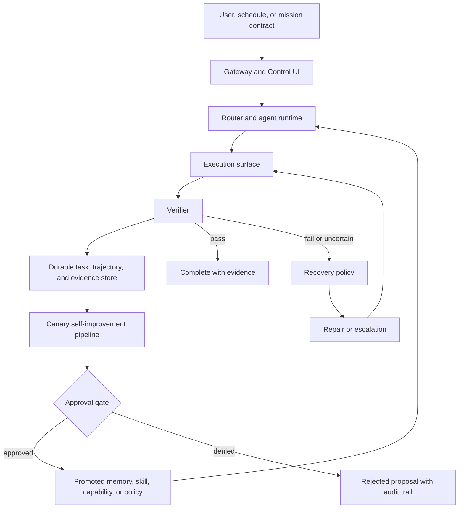

# boiled-claw Architecture Overview

boiled-claw is a browser-first, policy-bounded closed-loop agent runtime. It is
designed to move from normal computer-use tasks toward simulation-first physical
AI validation without changing the core execution contract.

The system is not organized around "LLM plus tools." It is organized around a
durable loop:

```text
plan -> execute -> verify -> repair -> record trajectory -> improve
```

## Main Layers

1. **Gateway and Control UI**
   The FastAPI Gateway exposes chat, task APIs, WebSocket events, approvals,
   audit logs, task timelines, and the browser-based Control UI.

2. **Agent runtime**
   The ADK-backed agent layer routes user requests to browser, current-tab,
   desktop, skills, memory, and supervisor capabilities.

3. **Execution surfaces**
   boiled-claw prefers structured current-tab and browser operations before
   falling back to desktop accessibility, screenshot, or hotkey control. Host
   and desktop bridges keep machine-control capabilities outside the Dockerized
   Gateway.

4. **Durable task and evidence substrate**
   Tasks, audit events, approvals, trajectories, scheduler state, checkpoints,
   mission contracts, verifier reports, and reuse traces are persisted so a run
   can be inspected, resumed, replayed, or reviewed later.

5. **Live supervisor runtime**
   Control-loop supervisors can run long-lived mission contracts, tick due
   scheduler entries, update heartbeat and checkpoint state, resume after
   Gateway restart, enforce typed abort conditions, and publish mission
   scorecards / post-mission reviews without creating a separate mission table.

6. **Self-improvement spine**
   Failed or uncertain trajectories can be classified, replayed, turned into
   repair candidates, benchmarked in isolated canaries, and promoted only after
   explicit approval and audit.

7. **Physical-ready adapter surface**
   Physical work stays simulation-first. Mission contracts, telemetry health,
   action envelopes, governor decisions, verifier reports, and replay plans are
   represented as durable artifacts before any restricted physical proof of
   concept is attempted. The first Mission OS physical replay slice is
   artifact-only: it can produce simulation scenario requests, telemetry health
   snapshots, blocked-or-dry-run safety decisions, dry-run action envelopes, and
   offline replay plans without adapter dispatch or actuator execution. A
   deterministic 2D grid-world toy simulator now gives this path a local
   testbed for obstacles, hazards, low battery, replay traces, and original
   retro top-down SVG visualization.

## Control Flow



## OSS v1.0 Candidate Boundary

boiled-claw's current physical/autonomy posture is evaluation-gated and
mission-level. The runtime is not a low-level controller, robot middleware,
autopilot, operating system, or browser replacement. It is the policy-bounded
control plane above heterogeneous execution surfaces: browser, desktop,
simulator, and telemetry-only HIL.

For the milestone-level summary, read
[oss-v1-readiness-boundary.md](oss-v1-readiness-boundary.md).

For a public, non-reproducible narrative of the private PX4/Gazebo drone
delivery milestone, read
[mission-os-px4-gazebo-delivery.md](mission-os-px4-gazebo-delivery.md). It
publishes the Mission OS safety architecture and result shape without releasing
the implementation, simulator setup, transport details, or smoke scripts.

For the next public-safe milestone notes, read
[mission-os-multi-phase-delivery.md](mission-os-multi-phase-delivery.md),
[mission-os-fleet-memory.md](mission-os-fleet-memory.md), and
[mission-os-shared-observation.md](mission-os-shared-observation.md), and
[mission-os-advisory-recovery-context.md](mission-os-advisory-recovery-context.md). These
notes describe the move from single-flight evidence to multi-phase mission
control, mission-to-mission feedback, intra-mission shared observation, and
advisory recovery proposal context. They keep the same publication boundary:
principles and results are public, while implementation and reproduction
details remain private.

The current OSS boundary is intentionally narrow: boiled-claw exposes the
Mission OS concepts and public-safe artifact philosophy, while keeping private
simulator integration details and physical-adjacent execution recipes out of
this overview.

This is a readiness boundary rather than a final release claim. It means the
reference architecture can model, review, replay, and evaluate mission-like work
as evidence chains. It does not claim production physical autonomy, certified
robot control, or live hardware operation.

## Public Mission OS Boundary

The public architecture is safe to understand at this level:

```text
mission contract
  -> evidence capture
  -> gate or verifier decision
  -> recovery or escalation policy
  -> replayable task history
  -> approval-gated promotion or reuse
```

That shape applies across browser tasks, desktop tasks, simulation-first tasks,
and telemetry-only physical-adjacent review. The common rule is that stronger
execution is never inferred from a model output, prior memory, or a successful
past run. Stronger action remains blocked unless a future contract explicitly
introduces the required approvals, responsibility boundaries, and operational
controls.

The public boundary explicitly does **not** provide:

- live robot control
- actuator execution
- hardware command channels
- autopilot replacement
- ROS / MAVLink dispatch
- mission upload
- approval-free stronger execution
- autonomous code self-modification

For the physical-adjacent milestones, this README deliberately stays at the
index and safety-boundary level. The detailed public-safe notes are:

- [Mission OS for PX4/Gazebo Drone Delivery](mission-os-px4-gazebo-delivery.md)
- [Mission OS Multi-Phase Delivery Milestone](mission-os-multi-phase-delivery.md)
- [Mission OS Fleet Memory Milestone](mission-os-fleet-memory.md)
- [Mission OS Shared Observation Milestone](mission-os-shared-observation.md)
- [Mission OS Advisory Recovery Context Milestone](mission-os-advisory-recovery-context.md)

Those notes publish principles and results, not implementation recipes.

## Mission Contract and Recovery Model

Mission work is represented as a durable contract plus evidence, not as an
unstructured prompt. A contract can define intent, allowed and forbidden action
categories, abort conditions, risk budget, memory policy, recovery policy, and
improvement policy.

The recovery model is similarly evidence-first. Failures are classified, mapped
to bounded recovery or escalation decisions, and persisted for later review. A
policy decision is treated as evidence; it is not automatic authority. If a
decision requires stronger action, the runtime must pause, block, or request
approval according to the mission policy.

The Control UI and task detail surfaces read these artifacts as review context.
They are not separate authority planes.

## Evidence, Memory, and Promotion

boiled-claw keeps memory and promotion paths explicit:

- raw transcripts are not automatically promoted to memory
- post-mission review can propose memory or improvement candidates
- candidates require approval before they become reusable artifacts
- approved memories can inform planning and review
- memory does not grant command authority
- capability or policy proposals are visible plan entries until separately
  registered or applied

This keeps the loop inspectable without turning past success into hidden runtime
permission.

## Physical-Adjacent Validation Posture

The physical-adjacent path is simulation-first and evidence-only at the public
architecture level. It can describe mission contracts, telemetry health, safety
decisions, dry-run envelopes, replay plans, and deterministic simulation traces.
It does not expose a public recipe for live dispatch, simulator orchestration,
command payloads, ports, sockets, raw logs, or validation chains.

The goal of this public overview is to explain the governance pattern:

```text
observe
  -> capture evidence
  -> evaluate against a contract
  -> preserve safety boundaries
  -> replay or review
  -> reuse only through policy
```

The private implementation can be stronger than what is described here; the
public documentation intentionally remains less specific than the private
validation assets.

## Current Maturity

boiled-claw already has the main contract surfaces: task objects, audit events,
approvals, trajectories, scheduler state, durable execution artifacts, live
supervisor resume, typed mission abort conditions, and simulation-first physical
runtime artifacts. Physical replay now has an artifact-only Mission OS path for
simulation scenario requests, telemetry health snapshots, safety governor
decisions, dry-run action envelopes, offline replay plans, and a deterministic
2D grid-world simulator; it does not apply those artifacts to live hardware.

The system is still a reference implementation. The live mission runtime is
active for control supervisors, but the project does not claim a distributed
scheduler, production robotics autonomy, or approval-free self-modification.

## Where To Read Next

- [Root architecture deep dive](../ARCHITECTURE.md)
- [Trajectory-native self-improving runtime](trajectory-native-self-improving-runtime.md)
- [Routing and execution](routing-and-execution.md)
- [Control loop and memory](control-loop-and-memory.md)
- [Host and desktop bridge](host-and-desktop-bridge.md)
