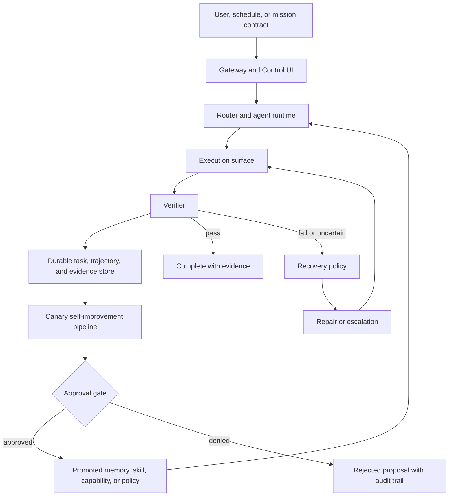

# boiled-claw Architecture Overview

boiled-claw is a browser-first, policy-bounded closed-loop agent runtime. It is
designed to move from normal computer-use tasks toward simulation-first physical
AI validation without changing the core execution contract.

The system is not organized around "LLM plus tools." It is organized around a
durable loop:

```text
plan -> execute -> verify -> repair -> record trajectory -> improve
```

## Main Layers

1. **Gateway and Control UI**
   The FastAPI Gateway exposes chat, task APIs, WebSocket events, approvals,
   audit logs, task timelines, and the browser-based Control UI.

2. **Agent runtime**
   The ADK-backed agent layer routes user requests to browser, current-tab,
   desktop, skills, memory, and supervisor capabilities.

3. **Execution surfaces**
   boiled-claw prefers structured current-tab and browser operations before
   falling back to desktop accessibility, screenshot, or hotkey control. Host
   and desktop bridges keep machine-control capabilities outside the Dockerized
   Gateway.

4. **Durable task and evidence substrate**
   Tasks, audit events, approvals, trajectories, scheduler state, checkpoints,
   mission contracts, verifier reports, and reuse traces are persisted so a run
   can be inspected, resumed, replayed, or reviewed later.

5. **Live supervisor runtime**
   Control-loop supervisors can run long-lived mission contracts, tick due
   scheduler entries, update heartbeat and checkpoint state, resume after
   Gateway restart, enforce typed abort conditions, and publish mission
   scorecards / post-mission reviews without creating a separate mission table.

6. **Self-improvement spine**
   Failed or uncertain trajectories can be classified, replayed, turned into
   repair candidates, benchmarked in isolated canaries, and promoted only after
   explicit approval and audit.

7. **Physical-ready adapter surface**
   Physical work stays simulation-first. Mission contracts, telemetry health,
   action envelopes, governor decisions, verifier reports, and replay plans are
   represented as durable artifacts before any restricted physical proof of
   concept is attempted. The first Mission OS physical replay slice is
   artifact-only: it can produce simulation scenario requests, telemetry health
   snapshots, blocked-or-dry-run safety decisions, dry-run action envelopes, and
   offline replay plans without adapter dispatch or actuator execution. A
   deterministic 2D grid-world toy simulator now gives this path a local
   testbed for obstacles, hazards, low battery, replay traces, and original
   retro top-down SVG visualization.

## Control Flow



## Mission Contract v2 Example

Mission work still enters through a `control_supervisor` task. The contract adds
manifest-level policy fields to the existing task artifact instead of creating a
separate mission table:

```yaml
schema_version: mission_contract.v2
contract_id: mission-research-watch-001
objective: Keep a research topic watch current with cited, non-duplicative updates.
allowed_actions:
  - web.search
  - browser.read
  - memory.search
forbidden_actions:
  - external_account_post
  - credential_read
abort_conditions:
  - type: human_approval_required
  - type: guardrail_budget_exhausted
success_metrics:
  - important new sources are captured with citations
  - duplicate findings are not promoted to memory
risk_budget:
  max_runtime_hours: 12
  max_same_failure_retries: 2
capability_policy:
  allow:
    - web.search
    - browser.read
  approval_required:
    - shell.run
memory_policy:
  promote_only:
    - fact
    - procedure
    - failure_pattern
    - recovery_pattern
  never_promote:
    - raw_transcript
    - secret
  require_operator_approval: true
recovery_policy:
  max_retries_per_step: 2
  ladder:
    - observe_again
    - verify_state
    - retry_smaller_step
    - alternate_capability
    - request_approval
    - pause_or_block
improvement_policy:
  mode: canary_only
  require_benchmark_pass: true
  require_human_promotion: true
```

## Recovery Ladder

Recovery Ladder v1 is the live bridge from verifier/tool failures to bounded
runtime behavior. A failed tick is classified, mapped to a typed ladder step,
checked against `mission_contract.recovery_policy`, and persisted as a
`recovery_decision` artifact in `durable_execution.recovery_decisions[]`.

Initial steps are:

```text
observe_again
verify_state
retry_same_step
retry_smaller_step
alternate_capability
diagnostic_task
request_approval
pause_or_block
create_improvement_candidate
```

Each persisted decision records the selected step, reason, attempt index,
budget before/after snapshots, outcome, and source refs to task/verifier/runtime
evidence when available. Non-terminal steps preserve the existing scheduler
policy; `request_approval` pauses into approval wait, and exhausted policy or
budget becomes `blocked`.

State semantics remain explicit:

| State | Meaning | Resume path |
| --- | --- | --- |
| `failed` | Execution was attempted and failed. | Requires repair or a new run. |
| `blocked` | Policy, budget, safety, environment, or recovery exhaustion prevents progress. | Requires operator or policy/budget intervention. |
| `paused` | Approval or operator input is required before continuing. | Can resume after the approval/input is resolved. |
| `cancelled` | An operator explicitly stopped the mission. | Does not auto-resume. |

Post-mission review is the next read-only layer. It reads `mission_contract`,
`durable_execution`, scheduler state, checkpoints, job runs, verifier verdicts,
recovery decisions, budget state, escalations, child task refs, and scorecard
state, then writes a versioned `mission_review` artifact. The review summarizes
the mission outcome, failure buckets, repeated failure patterns, recovery
effectiveness, evidence quality, candidate-only improvement proposals,
candidate-only memory promotion proposals, recommended contract edits, and
source refs.
A `paused` review is intentionally interim: it captures the approval-wait
boundary for operators, and a later terminal `completed`, `blocked`, or `failed`
review may replace it after the mission resumes.

Memory promotion candidates are formal approval-gated artifacts, not promoted
memory. `mission_review.memory_promotion_candidates` remains candidate-only
review output for backward compatibility, while
`artifacts.memory_promotion_candidates` contains normalized records with:

- `approval_status`: `pending`, `approved`, `rejected`, `expired`, or
  `candidate_only`
- `source_task_id`, `source_artifact_ref`, and `source_refs`
- `last_verified_at`, `expires_at`, and `invalidation_rule`
- `approved_by`, `approved_at`, and `rejected_reason`

Pending and approved candidates are not used by planning, recovery, or mission
reuse in this layer. They only make the review-and-approval boundary durable for
future reuse-planner work.

The Control UI task detail reads the same task artifacts directly. For
`control_supervisor` missions it exposes the current mission status, active node,
task graph, scheduler queues, recovery decisions, verifier evidence refs,
approval waits, budget exhaustion, mission scorecard, post-mission review, and
approval-gated memory candidate state without adding a separate mission API.

Mission templates are a small preset layer on top of `MissionContract v2`.
They generate validated contracts from typed inputs and safe defaults, then hand
the resulting payload to the existing `control_supervisor` API. Templates do not
create missions, runs, tables, or execution behavior by themselves. Initial
presets cover observation review, weak-evidence probing, budget-exhaustion
probing, current-tab research reports, and repository maintenance review.
Overrides may narrow allowed actions or add metadata, but they preserve default
forbidden actions so a template cannot silently drop safety constraints.

Mission eval suites are the measurement layer for the same artifact substrate.
They are deterministic and repo-local: a suite reads existing mission artifacts,
emits a serializable `mission_eval_result.v1`, and the regression gate compares
baseline vs candidate results as `mission_regression_gate.v1`. The gate blocks
on candidate failures, artifact-shape incompatibility, security eval failure, or
metric regression, while still representing operator approval as required. This
is groundwork for future benchmark-gated promotion; it does not promote memory,
run canaries, reuse approved artifacts, add UI, or introduce mission storage.

Physical replay safety eval suites extend that measurement layer to the toy
grid-world simulator before any autonomy runner exists. They inspect existing
`toy_grid_world_replay_trace.v1` artifacts and block regressions such as live
execution flags, physical execution invocation, accepted obstacle/hazard moves,
missing or stale telemetry, scenario-mismatched telemetry, non-dry-run action
envelopes, online replay plans, governor/step result mismatches, or
non-deterministic replay hashes. They also expose telemetry freshness as an
explicit metric for regression gates. These suites are artifact checks only;
they do not add simulator execution endpoints, UI controls, ROS dispatch,
actuator execution, `/missions`, or a `missions` table.

Promotion packages are the artifact-only bridge from post-mission review to a
future promotion pipeline. `mission_review.improvement_candidates` can be
normalized into typed promotion candidates, mapped to required eval suites, and
packaged with baseline/candidate `mission_eval_result.v1`,
`mission_regression_gate.v1`, and optional security eval evidence. The package
always remains `approval_status=pending` and `requires_operator_approval=true`.
It makes the benchmark-gate decision inspectable, but it does not create
approved memory, skills, capabilities, policies, code patches, runtime reuse,
UI behavior, `/missions`, or a `missions` table.

Approved promotion artifacts are the next artifact-only layer. An
approval-ready `promotion_package.v1` can become one of four typed artifacts
after explicit operator approval:

- `approved_improvement_memory.v1`: retrieval-only improvement knowledge.
- `approved_skill.v1`: a bounded reusable recipe.
- `capability_patch.v1`: a typed capability proposal that still requires
  runtime registration before use.
- `policy_patch.v1`: a safety or scope policy proposal.

The approval path preserves source package refs, benchmark refs, security eval
refs, approval metadata, expiry/invalidation metadata, and target-specific
schema fields. Listing helpers can filter usable approved artifacts by type and
ignore rejected or expired records. This still does not wire approved artifacts
into planning, recovery, runtime registration, or mission reuse.

Mission reuse plans close the artifact loop without changing runtime behavior.
A `reuse_plan.v1` compares a new `MissionContract` against usable approved
artifacts, selects relevant memories, skills, policy patches, and capability
patches, and records why each artifact was selected or excluded. The plan
preserves expiry checks, invalidation checks, policy checks, matched terms, and
operator-visible provenance. Capability and policy patches are selected only as
visible plan entries; they are not automatically registered or applied.
When approved promotion artifacts are supplied at `control_supervisor` mission
start, the Gateway records the generated `reuse_plan.v1` on task artifacts and
`durable_execution` and emits a `mission_reuse_plan_recorded` timeline event.
The Control UI task detail renders the selected memories, skills, policy
patches, capability patches, excluded candidates, expiry checks, policy checks,
and reuse-plan history. This remains a visibility path, not runtime reuse.

Non-goals for this layer: no automatic promotion, no hidden runtime reuse, no
canary benchmark execution, no runtime application from the UI, no `/missions`
API, and no `missions` table.

## Current Maturity

boiled-claw already has the main contract surfaces: task objects, audit events,
approvals, trajectories, scheduler state, durable execution artifacts, live
supervisor resume, typed mission abort conditions, and simulation-first physical
runtime artifacts. Physical replay now has an artifact-only Mission OS path for
simulation scenario requests, telemetry health snapshots, safety governor
decisions, dry-run action envelopes, offline replay plans, and a deterministic
2D grid-world simulator; it does not apply those artifacts to live hardware.

The system is still a reference implementation. The live mission runtime is
active for control supervisors, but the project does not claim a distributed
scheduler, production robotics autonomy, or approval-free self-modification.

## Where To Read Next

- [Root architecture deep dive](../ARCHITECTURE.md)
- [Trajectory-native self-improving runtime](trajectory-native-self-improving-runtime.md)
- [Routing and execution](routing-and-execution.md)
- [Control loop and memory](control-loop-and-memory.md)
- [Host and desktop bridge](host-and-desktop-bridge.md)
