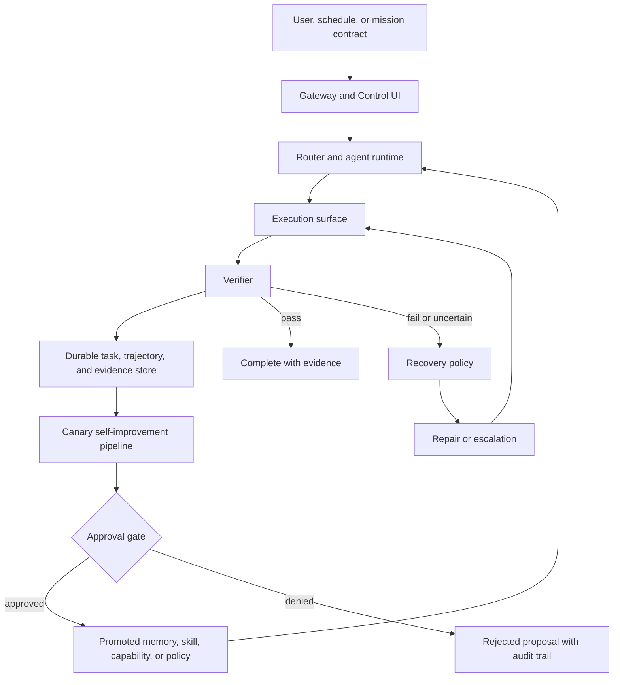

# boiled-claw Architecture Overview

boiled-claw is a browser-first, policy-bounded closed-loop agent runtime. It is
designed to move from normal computer-use tasks toward simulation-first physical
AI validation without changing the core execution contract.

The system is not organized around "LLM plus tools." It is organized around a
durable loop:

```text
plan -> execute -> verify -> repair -> record trajectory -> improve
```

## Main Layers

1. **Gateway and Control UI**
   The FastAPI Gateway exposes chat, task APIs, WebSocket events, approvals,
   audit logs, task timelines, and the browser-based Control UI.

2. **Agent runtime**
   The ADK-backed agent layer routes user requests to browser, current-tab,
   desktop, skills, memory, and supervisor capabilities.

3. **Execution surfaces**
   boiled-claw prefers structured current-tab and browser operations before
   falling back to desktop accessibility, screenshot, or hotkey control. Host
   and desktop bridges keep machine-control capabilities outside the Dockerized
   Gateway.

4. **Durable task and evidence substrate**
   Tasks, audit events, approvals, trajectories, scheduler state, checkpoints,
   mission contracts, verifier reports, and reuse traces are persisted so a run
   can be inspected, resumed, replayed, or reviewed later.

5. **Live supervisor runtime**
   Control-loop supervisors can run long-lived mission contracts, tick due
   scheduler entries, update heartbeat and checkpoint state, resume after
   Gateway restart, and enforce typed abort conditions.

6. **Self-improvement spine**
   Failed or uncertain trajectories can be classified, replayed, turned into
   repair candidates, benchmarked in isolated canaries, and promoted only after
   explicit approval and audit.

7. **Physical-ready adapter surface**
   Physical work stays simulation-first. Mission contracts, telemetry health,
   action envelopes, governor decisions, verifier reports, and replay plans are
   represented as durable artifacts before any restricted physical proof of
   concept is attempted.

## Control Flow



## Current Maturity

boiled-claw already has the main contract surfaces: task objects, audit events,
approvals, trajectories, scheduler state, durable execution artifacts, live
supervisor resume, typed mission abort conditions, and simulation-first physical
runtime artifacts.

The system is still a reference implementation. The live mission runtime is
active for control supervisors, but the project does not claim a distributed
scheduler, production robotics autonomy, or approval-free self-modification.

## Where To Read Next

- [Root architecture deep dive](../ARCHITECTURE.md)
- [Trajectory-native self-improving runtime](trajectory-native-self-improving-runtime.md)
- [Routing and execution](routing-and-execution.md)
- [Control loop and memory](control-loop-and-memory.md)
- [Host and desktop bridge](host-and-desktop-bridge.md)
