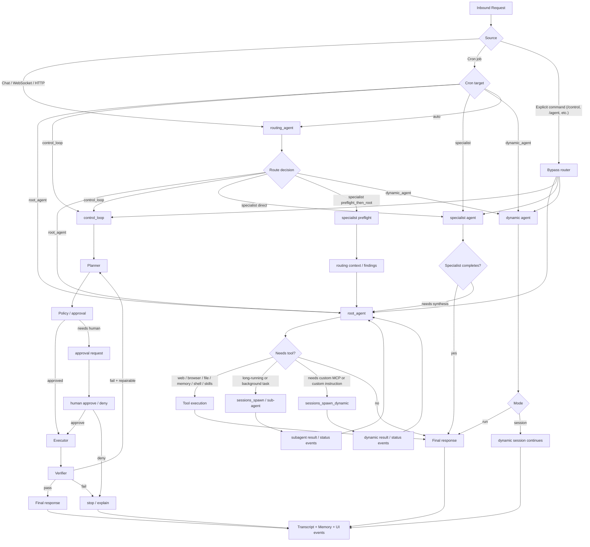

# Routing and Execution Architecture

## Overview

boiled-claw の routing は、OpenClaw の deterministic routing を土台にしつつ、
単一の Web UI / chat UX に合わせて **intent-based auto routing** を追加する。

目的は次の3つ。

- ユーザーの意図に従って自然に routing されること
- `root_agent` の責務を失わず、通常会話の中心を維持すること
- control loop / specialist / dynamic agent / cron / skills を一つの実行モデルで扱えること

この設計では、**`routing_agent` は判断だけを行い、実行はしない**。
実際の作業は `root_agent`、`control_loop`、specialist、dynamic agent が担う。

---

## Design Principles

### 1. Router is not executor

`routing_agent` は route decision のみを返す。
tool 実行、shell 実行、skill 実行、memory 書き込みは行わない。

### 2. root_agent remains the primary runtime

`root_agent` は通常会話の主担当であり続ける。
specialist の findings を統合し、最終回答を返す中心 agent とする。

### 3. Deterministic override before LLM routing

明示コマンド、UI override、session binding、cron target は
`routing_agent` より先に評価する。

### 4. Escalate only when necessary

長手順、高リスク、要検証、要承認の依頼だけ `control_loop` に上げる。

### 5. Visibility is part of the runtime

route 選択、handoff、approval、verification は
`system.event` / `tool.start` / `tool.result` として可視化する。

---

## Components

### routing_agent

責務:

- 入力文の intent を解釈する
- `root_agent` / `control_loop` / specialist / `dynamic_agent` を選ぶ
- specialist を `direct` で使うか `preflight_then_root` で使うか決める

制約:

- tool なし
- shell なし
- skills 実行なし
- JSON 出力のみ

推奨出力 schema:

```json
{
  "target": "root_agent | control_loop | specialist | dynamic_agent",
  "specialist": "web_researcher | file_manager | browser_automator | system_operator | memory_keeper | null",
  "handoff_mode": "direct | preflight_then_root",
  "reason": "short explanation",
  "confidence": 0.91,
  "dynamic_agent": {
    "instruction": "",
    "mcp_servers": [],
    "mode": "run"
  }
}
```

### root_agent

責務:

- 通常会話の主担当
- 軽い tool 実行
- specialist findings の統合
- final response の生成
- `sessions_spawn` / `sessions_spawn_dynamic` の起動
- skill 実行のハブ

### specialist agents

対象:

- `web_researcher`
- `file_manager`
- `browser_automator`
- `system_operator`
- `memory_keeper`

責務:

- 特定領域の preflight / direct execution
- 必要に応じて findings を `root_agent` に返す

### control_loop

責務:

- Planner → PolicyJudge → Executor → Verifier → Repair
- approval / capability / verification が必要な仕事
- 長手順・高リスク・要レポートの仕事

### dynamic_agent

責務:

- 既存 specialist で足りない専用 agent の起動
- MCP 接続や特化 instruction を持つ一時 agent

起動条件:

- ユーザーが明示的にカスタム agent を求める
- 特定 MCP / 独自 instruction / 継続セッションが必要

---

## Execution Flow



---

## Routing Rules

### Priority order

1. Explicit command
2. UI override
3. Session or channel binding
4. Cron explicit target
5. `routing_agent`
6. Fallback to `root_agent`

### Chat

Chat は原則 `routing_agent` を通す。
ただし `/control ...` や `/agent ...` のような明示コマンドは bypass する。

### Cron

cron は `target` を明示できるようにする。

- `target=root_agent`
- `target=control_loop`
- `target=specialist`
- `target=dynamic_agent`
- `target=auto`

`target=auto` のときだけ `routing_agent` を使う。
通常は deterministic target を推奨する。

### UI override

checkbox ではなく単一 selector を置く。

- `Auto`
- `Root`
- `Control Loop`
- `Web Researcher`
- `File Manager`
- `Browser`
- `System`
- `Memory`

既定は `Auto`。
override は route decision より優先する。

---

## How Special Cases Work

### shell execution

`routing_agent` は shell を実行しない。

shell を実行するのは次のいずれか。

- `root_agent`
- `system_operator`
- `control_loop` executor
- `dynamic_agent`

高リスク shell は tool approval を必須にする。

### skills

`routing_agent` は skill を実行しない。

skill 実行は原則 `root_agent` が行う。
ただし、skill が独自 MCP や長い専用 instruction を必要とする場合は
`dynamic_agent` を起動する。

### dynamic agent generation

`dynamic_agent` route は一級市民として扱う。

起動条件の例:

- 「この MCP サーバーを使って」
- 「専用 agent を作って」
- 「この instruction だけで動く別 agent に任せて」

### specialist preflight

`web_researcher` のような specialist は、
直接最終回答を返すよりも `preflight_then_root` の方が有効な場面が多い。

例:

- 最新情報の調査
- 参考ソースの収集
- browser extract の一次 findings

この場合、specialist は findings を返し、
`root_agent` が最終的な文脈統合と回答生成を行う。

---

## Role of root_agent After Introducing routing_agent

`routing_agent` を入れても `root_agent` は不要にならない。
むしろ責務が明確になる。

`root_agent` の主な責務:

- 通常会話の main runtime
- specialist findings の synthesis
- skill 実行のハブ
- background task / sub-agent の起点
- dynamic agent 起動の起点
- memory 保存と会話継続の責任主体

つまり:

- `routing_agent` = judge
- `root_agent` = operator

---

## UI / Event Model

ユーザーに見せるべきイベント:

- `Router selected web_researcher`
- `Router selected control loop`
- `Routing context forwarded to root_agent`
- `Dynamic agent started`
- `Verification passed`
- `Approval required`

UI の目的は route をユーザーに選ばせることではなく、
**何が判断され、どこへ handoff されたかを見せること** に置く。

---

## Recommended Rollout

### Phase 1

- heuristic router を `routing_agent` に置き換える
- `Auto` override selector を追加する
- route decision を `system.event` で可視化する

### Phase 2

- `dynamic_agent` を route target に昇格する
- cron `target=auto` を導入する
- specialist preflight の標準化

### Phase 3

- confidence-based fallback
- route explanation の改善
- session binding / user preference に基づく routing personalization

---

## Summary

boiled-claw の routing は、OpenClaw の deterministic routing を維持しつつ、
chat UX 向けに lightweight `routing_agent` を前段に置くハイブリッド構成が最も自然である。

この設計では:

- `routing_agent` は判断だけを行う
- `root_agent` は通常実行と統合の中心であり続ける
- `control_loop` は高リスク・長手順タスクを扱う
- specialist は preflight または direct execution を担う
- `dynamic_agent` は特化タスクのための拡張経路になる

これにより、ユーザーの intent に従って自然に routing されつつ、
OpenClaw 的な責務分離と predictability を失わない。
